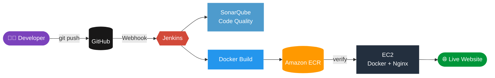

<div align="center">


### Push code. Watch it ship. Zero manual steps.

<p>
  
  
  
  
</p>
<p>
  
  
  
  
</p>

</div>

---

## ⚡ The Idea

A complete **DevOps pipeline** that takes code from a `git push` to a **live Docker container on AWS**, fully automated.
**Terraform** builds the infrastructure. **Jenkins** runs the show.

<div align="center">

```
 💻 Push  ➜  🔔 Webhook  ➜  🧪 SonarQube  ➜  🐳 Build  ➜  📦 ECR  ➜  ✅ Verify  ➜  🚀 Deploy
```

</div>

---

## 🏗️ Architecture



---

## 🔄 Pipeline Stages

| # | Stage | What happens |
|:-:|---|---|
| 1️⃣ | **Checkout** | Pulls the latest code from GitHub |
| 2️⃣ | **Verify Files** | Confirms required project files exist |
| 3️⃣ | **SonarQube Analysis** | Automated code-quality scan |
| 4️⃣ | **Build Image** | Builds the Docker image |
| 5️⃣ | **Login to ECR** | Authenticates with Amazon ECR |
| 6️⃣ | **Tag & Push** | Ships the image to the registry |
| 7️⃣ | **Verify ECR Image** | Checks the image really landed |
| 8️⃣ | **Deploy** | Replaces the old container with the new one |

---

## 🧰 Tech Stack

<div align="center">


</div>

---

## ☁️ Infrastructure (Terraform)

Everything on AWS is created with code. No console clicking.

```bash
terraform init      # 🔧 set up providers
terraform plan      # 👀 preview changes
terraform apply     # 🚀 build the infrastructure
terraform destroy   # 💣 tear it all down
```

**Provisions:** EC2 instance · Security Group · Key Pair

| Port | Service |
|:-:|---|
| `22` | 🔑 SSH |
| `80` | 🌐 Application |
| `8080` | 🛠️ Jenkins |
| `9000` | 🔍 SonarQube |

---

## 🐳 Run It Locally

```bash
docker build -t devops-portfolio .
docker run -d --name devops-app -p 80:80 devops-portfolio
```

Then open **http://localhost** 🎉

---

## 📁 Project Structure

```text
terraform-jenkins-project/
├── main.tf                    # AWS resources
├── variables.tf               # Configurable values
├── outputs.tf                 # Terraform outputs
├── Dockerfile                 # Nginx container
├── Jenkinsfile                # CI/CD pipeline
├── sonar-project.properties   # SonarQube config
└── index.html                 # The app
```

---

## 🔐 Security

Secrets like the **SonarQube token** and **AWS credentials** live in **Jenkins Credentials Manager**. They are never committed to the repo.

---

## 🗺️ Roadmap

- [ ] 🔒 HTTPS with SSL/TLS + custom domain
- [ ] 🏷️ Docker image versioning + ECR lifecycle policies
- [ ] 📈 Prometheus + Grafana monitoring
- [ ] 🔁 Blue/green or rolling deployments
- [ ] ☸️ Kubernetes deployment

---

<div align="center">

### 💡 Why I built this

Instead of learning DevOps tools one by one, I wired them into **one real workflow**,<br/>
to understand exactly what happens between `git push` and *"it's live."*

<br/>

**Built by [Adi-tya0311](https://github.com/Adi-tya0311)**

⭐ If you found this useful, drop a star!


</div>